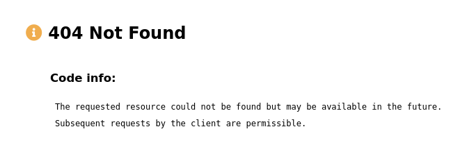
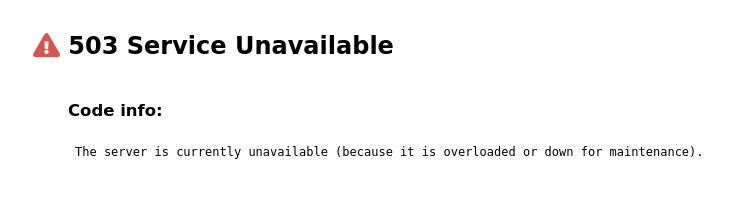
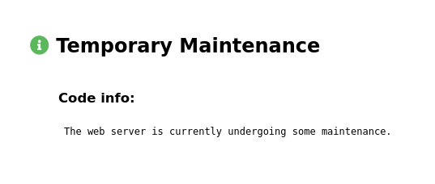

# HTTP Static Error Pages Generator

## Description

A simple to use generator for **static pages with errors** to replace the default error pages that come with any web server like **Nginx** or **Apache**.

## Use example

Then an example of starting the tool:

```bash
./httpgen
```

The command result is located in the **sites/** directory.

## Error examples

### 404 Not Found


### 503 Service Unavailable


### Temporary Maintenance


### Rate Limit


## Your own error pages

If you would like to add your own static pages to generate, edit the **src/other.json** file and add to it:

```bash
  {
    "code" : "903",
    "title": "HTTP Error Code",
    "desc" : "This is a example http error code description.",
    "icon" : "fas fa-info-circle blue"
  }
```

Description:

- `code` - specifies the response status codes (eg. 400, 404, 501)
- `title` - specifies the short title of status code, related to the `code` key (eg. "Not Found", "Bad Gateway")
- `desc` - determines the possible reason for the error (eg. "The web server is currently undergoing some maintenance")
- `icon` - sets a small icon from font-awesome for error code (eg. "fas fa-info-circle green", "fas fa-info-circle red")
